# Oracle CVE Threat Enrichment Engine

Analyzes a list of Oracle products and versions, maps applicable CVEs, enriches
them with risk signals (KEV, EPSS, ATT&CK, detection rules), and generates
self-contained HTML and JSON reports in the `REPORT/` directory.

The HTML report can be opened directly in a browser and includes full-text
search, filters, expandable CVE sections, ATT&CK techniques, detection rules,
patch references, and evidence references.

---

## Table of Contents

- [Quick Start](#quick-start)
- [Initial Installation](#initial-installation)
- [Input File Format](#input-file-format)
- [Main Command](#main-command)
- [Progress Output](#progress-output)
- [Product Catalog Enrichment](#product-catalog-enrichment)
- [Product Name Normalization](#product-name-normalization)
- [Oracle Advisory Scan (CPU + CSPU)](#oracle-advisory-scan-cpu--cspu)
- [Local Detection Rule Index](#local-detection-rule-index)
- [Analysis Modes](#analysis-modes)
- [Analysis Pipeline](#analysis-pipeline)
- [HTML Report](#html-report)
  - [Risk Posture calculation](#risk-posture-calculation)
  - [Risk Exposure Matrix — Host Risk Score](#risk-exposure-matrix--host-risk-score)
- [Signal Reference](#signal-reference)
- [Recommended Workflow](#recommended-workflow)
- [Troubleshooting](#troubleshooting)

---

## Quick Start

```bash
# First-time setup (interactive, guided)
python3 setup_first_run.py

# Run analysis
python3 -m oracle_cve_intel.cli analyze --input examples/products.csv --customer "Your Organisation" --html report.html

# Open report
open REPORT/report.html
```

---

## Initial Installation

### First-run setup script (recommended)

A guided interactive script is provided for first-time setup. It checks
prerequisites, creates the virtual environment, installs dependencies, and
optionally initializes the product catalog and detection index:

```bash
python3 setup_first_run.py
```

The script asks for confirmation before each action and can be safely
interrupted and re-run. The steps below describe the same process manually.

### 1. System requirements

The following must be available before running the engine:

**a. Python 3.10 or higher**
```bash
python3 --version
```

**b. git** (required to build the optional detection index)
```bash
git --version
```
Install from https://git-scm.com if not present.

**c. Internet access** — for NVD, CISA KEV, EPSS, and Oracle CPU advisories

**d. ~500 MB free disk space** — only if building the detection index

### 2. Virtual environment (recommended)

```bash
cd v1
python3 -m venv .venv
source .venv/bin/activate        # macOS / Linux
# .venv\Scripts\activate         # Windows
```

### 3. Install dependencies

```bash
python3 -m pip install -r requirements.txt
```

### 4. NVD API key (optional but recommended)

Request a free key at: https://nvd.nist.gov/developers/request-an-api-key

```bash
export NVD_API_KEY=<your_key>
```

Without a key the engine still works, but NVD calls will be slower and
rate-limited.

### 5. Initialize the product catalog

```bash
python3 -m oracle_cve_intel.cli update-aliases
```

Run once, then periodically to pick up new Oracle products.

### 6. Build the detection index (optional)

```bash
python3 -m oracle_cve_intel.cli detection-index --refresh --rebuild
```

This step takes a few minutes. It enables detection coverage results in
reports. Without this index the analysis runs normally but without detection
mapping.

### 7. Generate your first report

```bash
python3 -m oracle_cve_intel.cli analyze \
  --input examples/products.csv \
  --customer "Organisation Name" \
  --html report.html
```

Open `REPORT/report.html` in a browser.

---

## Input File Format

The CSV file must contain the following mandatory columns.

**Mandatory columns:**

| Column | Description |
|---|---|
| `product_name` | Oracle product name (e.g. `Oracle WebLogic Server`) |
| `version` | Installed version (e.g. `12.2.1.4`, `19.3`, `8u351`) |
| `host` | Host identifier (e.g. `web001`, `db-prod-01`) |
| `notes` | Free-text note (e.g. `Internet-facing`, `core database`) |

**Optional columns:**

| Column | Description |
|---|---|
| `owner` | Responsible owner or team — used in the Risk Exposure Matrix |
| `tier` | Business criticality tier: `0` Mission Critical · `1` Critical · `2` Important · `3` Standard |

> **Backward compatibility:** `machine_id` is accepted as a fallback if `host` is absent.

**Minimal example:**

```csv
product_name,version,host,notes
Oracle WebLogic Server,12.2.1.4,web001,Internet-facing
Oracle Database Server,19.3,db001,core database
```

**Full example:**

```csv
product_name,version,host,notes,owner,tier
Oracle WebLogic Server,12.2.1.4,web001,Internet-facing,platform,1
Oracle Database Server,19.3,db001,core database,dba,0
Oracle E-Business Suite,12.2.10,ebs001,ERP production,finance,1
```

**Tier reference:**

| Value | Label |
|---|---|
| `0` | Mission Critical |
| `1` | Critical |
| `2` | Important |
| `3` | Standard |

Sample files: `examples/products.csv`, `examples/products3.csv`

---

## Main Command

Run a full analysis and generate both report formats:

```bash
python3 -m oracle_cve_intel.cli analyze \
  --input examples/products.csv \
  --customer "Organisation Name"
```

The `--customer` flag is optional. If omitted, the report displays `UNKNOWN_ORG`
as the organisation name.

Without explicit format options, the engine generates JSON and HTML by default:

```
REPORT/findings.json
REPORT/report.html
REPORT/report.log
```

To specify output file names explicitly:

```bash
python3 -m oracle_cve_intel.cli analyze \
  --input examples/products.csv \
  --customer "Organisation Name" \
  --json findings.json \
  --html report.html
```

Output files are always created under `REPORT/`.

### Flags reference

| Flag | Description |
|---|---|
| `--customer NAME` | Organisation name shown in the report header |
| `--json FILE` | JSON output filename (created under `REPORT/`) |
| `--html FILE` | HTML output filename (created under `REPORT/`) |
| `--min-severity LEVEL` | Filter to `low` / `medium` / `high` / `critical` |
| `--include-unconfirmed` | Include CVEs with generic or uncertain version mapping |
| `--skip-detection` | Skip detection rule lookup (faster) |
| `--offline` | Use cached data only, no network calls |
| `--mock` | Demo mode — synthetic data, not for real decisions |

---

## Progress Output

During execution, the current step is displayed:

```
[input     ] Reading examples/products.csv ...
[normalize ] Normalizing product names ...
[map       ] Mapping products to CVEs (Oracle CPU + NVD) ...
[enrich    ] Enriching CVEs with CVSS / KEV / EPSS ...
[threat    ] Fetching threat context ...
[detect    ] Looking up detection rules in local DB ...
[prioritize] Computing finding priorities ...
[report    ] Writing HTML report to REPORT/report.html ...
[done      ] Run complete. Log written to REPORT/report.log.
```

For products where NVD returns only generic CPEs (no specific version range),
the engine performs an additional scan of Oracle CPU advisories:

```
[map       ] [2/3] Oracle advisory confirmed 36 CVEs for Oracle Database 19.3
             (January 2017 – April 2026).
```

If the version does not appear in any advisory for the period (product possibly
out of support), a warning is emitted and an informational finding is created:

```
[map       ] WARN - Oracle E-Business Suite 12.1: scanned 26 Oracle CPU
             advisories (January 2017 – April 2026), 0 CVEs confirmed for this
             version. This product/version may not be covered by recent Oracle
             security patches.
```

---

## Product Catalog Enrichment

By default, the engine uses `data/product_aliases.json` and `data/cpe_map.json`
to normalize product names. These files cover common Oracle products.

To automatically enrich these catalogs from the NVD CPE dictionary (all Oracle
products known to NVD):

```bash
python3 -m oracle_cve_intel.cli update-aliases
```

This command:

- Queries NVD for all Oracle products (`cpe:2.3:a:oracle:*`)
- Adds new products to `data/cpe_map.json`
- Automatically generates aliases without the "Oracle " prefix
  (e.g. `WebLogic Server` → `Oracle WebLogic Server`)
- Preserves all existing entries
- Caches the result (TTL 7 days)

To preview what would be added without modifying any files:

```bash
python3 -m oracle_cve_intel.cli update-aliases --dry-run
```

To run in offline mode (uses the existing NVD cache):

```bash
python3 -m oracle_cve_intel.cli update-aliases --offline
```

Recommended workflow: run `update-aliases` once before the first analysis, then
periodically to cover new Oracle products.

---

## Product Name Normalization

During analysis, the engine normalizes each product name in three steps:

1. Exact match in `product_aliases.json` (confidence: **HIGH**)
2. Token-based fuzzy match if step 1 fails (confidence: **MEDIUM**)
   — e.g. `WebLogic Server` → `Oracle WebLogic Server`
3. No match: the raw name is kept as-is (confidence: **LOW**)

Normalization confidence is shown in the report (field "Mapping Confidence").
A product with LOW confidence has no known CPE prefix and cannot be mapped to
NVD CVEs.

---

## Oracle Advisory Scan (CPU + CSPU)

For products where NVD has no specific version ranges (generic CPEs, e.g.
Oracle E-Business Suite), the engine scans Oracle advisories:

- **CPU (Critical Patch Update)** — quarterly, released in January, April, July, October
- **CSPU (Critical Security Patch Update)** — monthly, released on the **third Tuesday** of each month from 2026; targeted, high-priority fixes that complement the quarterly CPU cycle

Both advisory types are scanned from 2017 (CPU) and 2026 (CSPU) to the current date. For each advisory, the engine identifies the matching product section and checks whether the installed version falls within the affected range declared by Oracle. Findings are tagged with `patch_type = cpu` or `patch_type = cspu` accordingly.

Three possible outcomes:

1. **CVEs are confirmed for the installed version** — they appear in the report
   with status `CONFIRMED_AFFECTED` and a direct link to the Oracle advisory (CPU or CSPU).

2. **Generic NVD CVEs exist but are not confirmed** — they remain in the "NVD
   wildcard" section of the report (unconfirmed).

3. **No CVEs confirmed and all NVD CVEs are generic** — an informational finding
   is created. The version does not appear in any Oracle advisory for the period,
   likely because it is out of Oracle support.

Advisories are cached locally after the first fetch. Subsequent runs use the
cache and are very fast.

---

## Local Detection Rule Index

By default, the analysis uses a local SQLite database to look up detection
rules. It does not clone or scan rule repositories during a normal analysis run.

To create or update the local index:

```bash
python3 -m oracle_cve_intel.cli detection-index --refresh --rebuild
```

This clones or updates SigmaHQ and Elastic rule sources, then builds the index
at `data/cache/detection_rules.sqlite`.

To rebuild from locally available repositories only (no network):

```bash
python3 -m oracle_cve_intel.cli detection-index --offline --rebuild
```

Indexing progress:

```
[detect    ] Indexing SigmaHQ rules ...
[detect    ] Indexed 500 searchable rules from 546 scanned files.
[detect    ] Indexing Elastic rules ...
[detect    ] Detection index complete: 12003 searchable rules from 26540 scanned files.
```

If the local database does not exist at analysis time, the engine continues and
displays:

```
[detect    ] Local detection DB not found. Run `detection-index --refresh` to enable detection mapping.
```

---

## Analysis Modes

### With detection (default)

Once the local index exists, it is used automatically:

```bash
python3 -m oracle_cve_intel.cli analyze \
  --input examples/products.csv \
  --json findings.json \
  --html report.html
```

### Without detection (`--skip-detection`)

Produces a report quickly without detection lookups:

```bash
python3 -m oracle_cve_intel.cli analyze \
  --input examples/products.csv \
  --skip-detection
```

### Offline mode (`--offline`)

Avoids network calls — uses cached NVD, KEV, and EPSS data only. Results may be
incomplete if those caches are not populated.

```bash
python3 -m oracle_cve_intel.cli analyze \
  --input examples/products.csv \
  --offline
```

### Mock mode (`--mock`)

Intended for demos or quick tests without live data. Reports generated in mock
mode must not be used for real patching decisions.

```bash
python3 -m oracle_cve_intel.cli analyze \
  --input examples/products.csv \
  --mock
```

### Severity filtering (`--min-severity`)

Show only CVEs at or above a minimum severity level:

```bash
python3 -m oracle_cve_intel.cli analyze \
  --input examples/products.csv \
  --min-severity high
```

Accepted values: `low`, `medium`, `high`, `critical`

### Including uncertain mappings (`--include-unconfirmed`)

By default, CVEs with insufficient version data or confirmed only by a generic
NVD CPE are excluded from the main report. To include them:

```bash
python3 -m oracle_cve_intel.cli analyze \
  --input examples/products.csv \
  --include-unconfirmed
```

---

## Analysis Pipeline

The diagram below shows the full processing pipeline executed by `analyze`.
Each stage is independent and can fall back gracefully on cache or skip on error.

```mermaid
flowchart TD
    A([products.csv]) --> B

    subgraph INPUT ["① Input & Normalisation"]
        B["read_csv\nParse CSV → ProductRecord list\nColumns: product_name · version · host · owner · tier"]
        B --> C["normalize\nAlias lookup · CPE prefix resolution\nConfidence: HIGH / MEDIUM / LOW"]
        C --> D["check_support\n① endoflife.date API\n② oracle_support_dates.json\nStatus: Supported / Extended / EOL / Unknown"]
    end

    D --> E

    subgraph MAP ["② CVE Mapping"]
        E["NvdCVEMapper\nQuery NVD CPE API per product"]
        E --> E1{"NVD returns\ngeneric CPE?"}
        E1 -->|No version ranges| E2["Oracle Advisory Scan\nCPU: quarterly · Jan Apr Jul Oct\nCSPU: monthly · 3rd Tuesday 2026→now\npatch_type = cpu ∣ cspu\nConfirm affected versions"]
        E1 -->|Specific version ranges| E3["Version range check\nConfirmed / Potentially affected\n/ NVD wildcard"]
        E2 --> F
        E3 --> F
        F["FindingRecord list\nCVE × product pairs\nPatchReferenceRecord.patch_type"]
    end

    F --> G

    subgraph ENRICH ["③ CVE Enrichment"]
        G["RealCVEEnricher"]
        G --> G1["CISA KEV catalog\nFlags KEV status"]
        G --> G2["FIRST EPSS API\nExploitation probability score"]
        G --> G3["NVD fallback per CVE\nCVSS score · severity · published date\nPrefers NVD Primary over CNA Secondary"]
    end

    G1 & G2 & G3 --> H

    subgraph THREAT ["④ Threat Context"]
        H["RealThreatContextEnricher\nPublic exploit signal\nActive exploitation\nATT&CK technique inference"]
    end

    H --> I

    subgraph DETECT ["⑤ Detection Coverage"]
        I{"--skip-detection?"}
        I -->|No| I1["DetectionDbMapper\nSQLite index: SigmaHQ · Elastic\nSplunk · Azure Sentinel\nMatch by CVE ID or ATT&CK technique"]
        I -->|Yes| I2["Mark all as detection gap"]
        I1 & I2 --> J["detection_gap flag per finding"]
    end

    J --> K

    subgraph PRIO ["⑥ Prioritisation & Filtering"]
        K["prioritize\nComposite score: CVSS · KEV · EPSS\n· CSPU +20 · exploit · detection gap\n· support status\n→ Priority: Critical / High / Medium / Low"]
        K --> K1["Severity filter\n--min-severity"]
        K1 --> K2["Split confirmed vs suppressed\nNVD wildcard → appendix\nUnconfirmed → suppressed unless --include-unconfirmed"]
    end

    K2 --> L

    subgraph REPORT ["⑦ Report Generation"]
        L["write_html + write_json"]
        L --> L1["REPORT/report.html\nExec summary · Risk Exposure Matrix\nKey Technical Drivers incl. CSPU driver\nCVE cards with CSPU badge · Patch Lag"]
        L --> L2["REPORT/findings.json\nMachine-readable export"]
        L --> L3["REPORT/report.log\nAPI calls · warnings · errors"]
    end

    style INPUT  fill:#f0f9ff,stroke:#bae6fd
    style MAP    fill:#fefce8,stroke:#fde68a
    style ENRICH fill:#fff7ed,stroke:#fed7aa
    style THREAT fill:#fdf4ff,stroke:#e9d5ff
    style DETECT fill:#f0fdf4,stroke:#bbf7d0
    style PRIO   fill:#faf5ff,stroke:#ddd6fe
    style REPORT fill:#f8fafc,stroke:#cbd5e1
```



**External data sources used during the pipeline:**

| Stage | Source | Cached | TTL |
|---|---|---|---|
| Support check | `oracle_support_dates.json` (local) | n/a | Refresh manually |
| Support check | endoflife.date API | ✓ | 24 h |
| CVE mapping | NVD CPE API | ✓ | 7 days |
| CVE mapping | Oracle CPU advisory HTML (quarterly) | ✓ | 7 days |
| CVE mapping | Oracle CSPU advisory HTML (monthly, 2026+) | ✓ | 7 days |
| KEV enrichment | CISA KEV JSON feed | ✓ | 24 h |
| EPSS enrichment | FIRST EPSS API | ✓ | 7 days |
| Detection rules | Local SQLite index | ✓ | Manual rebuild |

---

## HTML Report

Open `REPORT/report.html` in a browser.

**Features:**

- **Executive Summary** (collapsible) with:
  - Scope line: hosts · distinct products · deployments assessed
  - Risk headline — plain-language one-sentence verdict
  - Deployment-level risk pills (e.g. *4 Critical deployments · 2 EOL Products · since 2013*)
  - Risk Posture badge (CRITICAL / HIGH / MODERATE / LOW)
  - **Risk Exposure Matrix** — owner × host heatmap; each card placed by Host Risk Score with a clickable popup showing the full score breakdown
  - **Key Business Drivers** table — owner, tier, product, version, host, support status, Host Score with formula popup
  - **Key Technical Drivers** — expandable signal drivers grouped by owner → host → CVE:
    - CSPU — CVEs addressed in Oracle emergency Critical Security Patch Update
    - KEV — CVEs actively exploited in the wild (CISA catalog)
    - CVSS > 9.0 — maximum-severity CVEs, split active vs EOL-only
    - Patch Lag — average days from CVE publication to Oracle advisory
    - Permanent exposure — EOL CVEs with no vendor patch path
    - Detection blind spot, Critical priority, Public exploit
  - Data freshness — age of each cached source (KEV, NVD, EPSS, CSPU)
- **Finding cards** with CSPU ⚡ / KEV ⚑ / Public Exploit badges; Priority score; CVSS severity; Detection state
- Full-text search
- Filters by priority, detection coverage, product, host, KEV, and public exploit
- Expandable CVE sections with:
  - ATT&CK Techniques
  - Detection Rules
  - Patch References — CPU and CSPU advisory links with `patch_type` distinction
  - Patch Lag — per-CVE lag calculation with method note and references
  - Priority Explanation — narrative including CSPU mention when relevant
  - Evidence References
- **Host Coverage** — host-grouped view with owner, tier, products, priority counts
- **Product Coverage** — product-grouped expandable view with version/host rows
- Support Status block with direct link to Oracle Lifetime Support page
- Direct links to all external references
- Separate section for products with no confirmed CVE (NVD wildcard or version out of Oracle support)

### Risk Posture calculation

The posture rating is determined by evaluating conditions in order — the first
match wins:

| Posture | Condition |
|---|---|
| **CRITICAL** | At least one KEV (actively exploited CVE) |
| **CRITICAL** | EOL product with tier 0 or 1 **and** at least one Critical-priority finding |
| **HIGH** | One or more Critical-priority findings, **or** > 10 findings with a public exploit |
| **MODERATE** | One or more High-priority findings |
| **LOW** | None of the above |

Detection gap is intentionally excluded from the posture thresholds. Public
rule repositories (SigmaHQ, Elastic) have limited coverage for DB-layer and
application-layer products such as Oracle Database or EBS — absence of a public
rule does not mean the environment is unmonitored. The detection gap remains
visible as a driver in the executive summary for operational follow-up.

**Tier and posture:** Risk Posture is evaluated only on Tier 0 and Tier 1
assets. A product on End-of-Life support escalates posture to CRITICAL only if
its tier is `0` (Mission Critical) or `1` (Critical) and at least one Critical
finding exists. Tier `2` (Important) and `3` (Standard) assets are excluded
from posture escalation.

### Risk Exposure Matrix — Host Risk Score

The **Risk Exposure Matrix** in the executive summary places each `(owner, host)` pair in exactly one column based on a **Host Risk Score**. This score combines finding severity breadth, active threat signals, and business criticality into a single integer.

#### Formula

```
base    = (n_critical × 40) + (n_high × 10) + (n_medium × 3) + (n_low × 1)
signals = (n_kev × 30) + (n_cspu × 20) + (n_eol × 15) + (n_exploit × 10)
score   = round((base + signals) × tier_multiplier)
```

`n_critical / n_high / n_medium / n_low` are counts of **unique CVE IDs whose composite priority score placed them at that tier** on this host — not raw CVSS severity bands. A CVE with CVSS 8.5 (High severity) can reach Critical *priority* if it is also KEV-listed, has a public exploit, or affects an EOL product. The base therefore reflects post-prioritisation risk, not the vendor-assigned severity alone.

`n_kev / n_cspu / n_eol / n_exploit` count unique CVE IDs carrying that signal on this host. `n_eol` counts CVEs on products that have reached End of Life — these will never receive a vendor patch, making them a permanent unresolvable exposure.

#### Tier multiplier

| Tier | Label | Multiplier |
|---|---|---|
| 0 | Mission Critical | × 2.5 |
| 1 | Critical | × 2.0 |
| 2 | Important | × 1.5 |
| 3 / Unknown | Standard | × 1.0 |

#### Column placement thresholds

| Score | Column |
|---|---|
| ≥ 60 | Critical |
| ≥ 20 | High |
| ≥ 5 | Moderate |
| < 5 | Low |

#### Rationale

| Component | Weight | Justification |
|---|---|---|
| Critical finding | 40 | Highest individual finding severity |
| KEV signal | +30 | Active exploitation confirmed by CISA |
| CSPU signal | +20 | Oracle declared too critical for quarterly cycle |
| EOL CVE signal | +15 | No vendor patch will ever be issued — permanent exposure |
| High finding | 10 | Significant but patchable within standard SLA |
| Public exploit | +10 | Weaponised attack code publicly available |
| Medium finding | 3 | Elevated but lower immediacy |
| Low finding | 1 | Baseline presence |
| Tier multiplier | × 1.0–2.5 | Business criticality scales the entire score |

The badge in each card shows the Host Risk Score. Hovering the badge displays the CVE count and the scoring formula components.

---

## Signal Reference

**CSPU**
Oracle issued an out-of-band Critical Security Patch Update (CSPU) for this CVE. CSPUs are released on the third Tuesday of each month (from 2026) for vulnerabilities too critical to wait for the quarterly CPU cycle. A CSPU signal adds +20 to the Host Risk Score and +20 to the per-finding composite priority score.

**KEV**
The CVE is listed in the CISA Known Exploited Vulnerabilities catalog.

**EPSS**
Probabilistic score from FIRST EPSS indicating the observed likelihood of
exploitation in the wild.

**Public exploit**
Signal derived from public references, KEV status, or evidence indicated in
enriched sources.

**ATT&CK Techniques**
MITRE ATT&CK techniques associated by threat context or inference.

**Detection Rules**
Rules found in the local detection index, matched by CVE ID or associated
ATT&CK technique.

**CVSS Score**
The highest available CVSS version is used (4.0 → 3.1 → 3.0 → 2.0). When
multiple scorers exist for the same version (e.g. NVD and the CNA submitter),
the **NVD Primary** score is preferred. The CNA Secondary score is used only
when no Primary score exists.

**Patch Lag**
Per-CVE metric computed as the number of days between the NVD publish date and
the earliest Oracle advisory (CPU or CSPU) that addressed the CVE. Advisory
release dates are approximated as the 15th of the advisory month. EOL products
are excluded — the metric targets products under active Oracle support only. The
executive summary shows the average lag across all CVEs where both dates are
available; each CVE card shows the individual breakdown with references. CSPU
advisories produce shorter lags than quarterly CPUs by design.

**Patch References**
CVE-specific Oracle advisory extracted automatically from NVD references or from
a direct advisory scan. The `patch_type` field distinguishes `cpu` (quarterly)
from `cspu` (monthly emergency). Each card shows:

| Field | Notes |
|---|---|
| Source | Clickable link to the specific Oracle advisory (e.g. Oracle CPU January 2025 or Oracle CSPU May 2026) |
| Product | Normalized name of the affected product |
| Affected versions | Product version from the input file |
| Affected component | Internal component affected, if available in the advisory |
| Fixed version | "not specified" if not publicly available — exact version requires My Oracle Support |
| Patch ID | "not specified" if not publicly available — exact bundle ID requires MOS |
| Notes | Reference advisory and MOS access note if applicable |

**Evidence References**
Links to NVD, CISA KEV, advisories, and other sources used to justify the
finding.

---

## Recommended Workflow

```bash
# 1. Enrich the product catalog (once, then periodically)
python3 -m oracle_cve_intel.cli update-aliases

# 2. Update the detection index periodically
python3 -m oracle_cve_intel.cli detection-index --refresh --rebuild

# 3. Run the standard analysis
python3 -m oracle_cve_intel.cli analyze \
  --input your_products.csv \
  --customer "Organisation Name" \
  --json findings.json \
  --html report.html

# 4. Open REPORT/report.html and prioritize:
#    Critical > KEV = true > Public exploit > High EPSS
#    > Production / internet-facing / high-criticality assets
```

---

## Troubleshooting

**A product is not recognized (LOW confidence, no CVEs found)**

Check that the product is present in `data/cpe_map.json`. If missing:

```bash
python3 -m oracle_cve_intel.cli update-aliases
```

If the product exists in NVD under a different name, add a manual alias in
`data/product_aliases.json`:

```json
"My Internal Alias": "Canonical Oracle Name"
```

---

**Detection results are empty**

Check that the index exists at `data/cache/detection_rules.sqlite`. If not:

```bash
python3 -m oracle_cve_intel.cli detection-index --refresh --rebuild
```

---

**Analysis is slow**

The first run scans up to 38 Oracle CPU advisories (2017–present) for products
with generic CPEs. These pages are then cached — subsequent runs are fast. For
a quick run without advisory scanning:

```bash
python3 -m oracle_cve_intel.cli analyze \
  --input examples/products.csv \
  --skip-detection
```

---

**The report does not appear**

Reports are always created under `REPORT/` regardless of the argument value.
For example, `report.html` becomes `REPORT/report.html`.

---

**Data appears incomplete**

Re-run without `--offline`, check network connectivity, and configure
`NVD_API_KEY` if possible.

---

**Patch References show a generic advisory instead of a specific link**

The NVD references for this CVE do not contain an `oracle.com/security-alerts/cpu*`
link. This is expected for third-party CVEs (Apache, OpenSSL, etc.) that affect
Oracle products through a dependency — a specific Oracle advisory does not always
exist. Refer to the third-party component's advisory via the Evidence References
section instead.

---

**The report shows "0 CVEs confirmed" for a product**

The installed version does not appear in any Oracle CPU advisory for the
2017–present period. Possible causes:

- The product/version is out of Oracle support (Premier or Extended Support
  ended) and is no longer covered by quarterly CPUs.
- The version is too recent to appear in already-published advisories.

Recommended action: verify the Oracle support status for this product and
migrate to a supported release if applicable.

---

**A CSV column is not recognized**

Only `product_name`, `version`, `machine_id`, and `notes` are mandatory. The
columns `owner` and `tier` are optional. Any other column is silently ignored.
The `environment` and `criticality` columns are not supported — use `notes` for
environment information and `tier` (0–3) for business criticality.
